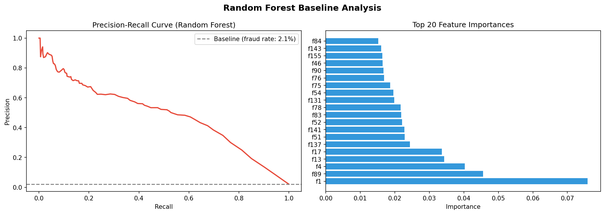
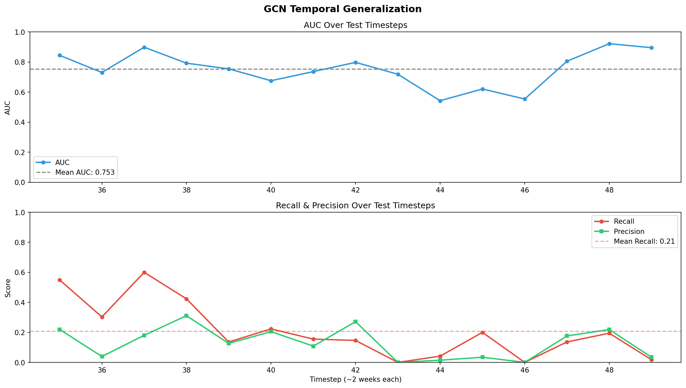

# Bitcoin Fraud Detection Using ML and Graph Neural Networks

## Overview

This project investigates **Licit vs. Illicit Bitcoin transaction classification** using:

- Random Forest
- XGBoost
- Graph Convolutional Network (GCN)
- Graph Attention Network (GAT)

The project compares feature-based ensemble learning with graph-based learning on the Elliptic Bitcoin transaction network.


## Dataset

The Elliptic Bitcoin dataset represents transactions as graph nodes with **165 features per transaction**. Edges represent transaction relationships. Supervised labels are:

- Licit
- Illicit

Unknown nodes are not used as labelled supervised targets.

### Class distribution

Among labelled nodes:

- Licit: **157,205**
- Illicit: **4,545**

The strong class imbalance makes accuracy alone insufficient.


## Graph Structure

The transaction network is represented as:

`G = (V, E)`

where `V` represents transactions and `E` represents transaction relationships.


## Temporal Analysis

The dataset is divided into timesteps. Fraud rates vary over time, motivating a temporal train/test split.

For the reported XGBoost experiment:

- Training: **timesteps 1–34**
- Test: **timesteps 35–49**
- Test nodes: **16,670**


# Models

## Random Forest

Random Forest is used as a strong tabular baseline.

Configuration:

```text
n_estimators = 100
class_weight = "balanced"
random_state = 42
n_jobs = -1
```

`class_weight="balanced"` compensates for the minority illicit class.

## XGBoost

XGBoost provides a second tabular baseline using sequential gradient boosting.

Configuration:

```text
n_estimators = 500
max_depth = 7
learning_rate = 0.05
subsample = 0.8
colsample_bytree = 0.8
scale_pos_weight = 7.63
objective = "binary:logistic"
eval_metric = "aucpr"
tree_method = "hist"
random_state = 42
```

### Why PR-AUC?

`eval_metric="aucpr"` is a **monitoring/evaluation metric**, not the training objective.

```text
objective="binary:logistic" → training objective
eval_metric="aucpr"         → monitored evaluation metric
```

PR-AUC is appropriate for the strongly imbalanced illicit class because it evaluates precision-recall behaviour across thresholds.

## GCN

The actual GCN architecture is:

```text
165 → 64 → 64 → 2
```

```text
GCNConv(165, 64)
    ↓ ReLU
    ↓ Dropout(0.5)
GCNConv(64, 64)
    ↓ ReLU
    ↓ Dropout(0.5)
GCNConv(64, 2)
```

Reasoning:

- **165:** original features per transaction.
- **64:** compact hidden representation.
- **3 GCN layers:** approximately 1-hop, 2-hop and 3-hop information propagation.
- **ReLU:** non-linearity.
- **Dropout 0.5:** regularization.
- **2 outputs:** Licit and Illicit.

Training uses Adam, learning rate `0.01`, weight decay `5e-4`, and class-weighted cross entropy.

## GAT

The actual GAT architecture is:

```text
165 → 32×4 → 32×4 → 2
```

```text
GATConv(165, 32, heads=4)
    ↓
128 features
    ↓ ELU
    ↓ Dropout(0.5)
GATConv(128, 32, heads=4)
    ↓
128 features
    ↓ ELU
    ↓ Dropout(0.5)
GATConv(128, 2, heads=1, concat=False)
    ↓
2 class outputs
```

Each hidden head produces 32 features:

`32 × 4 = 128`

The final layer produces two class outputs.

GAT is used because neighbouring transactions may not be equally informative. Attention allows the model to learn different importance weights for neighbouring nodes.

# Results

## Random Forest

```text
              precision    recall  f1-score   support

Licit           0.98      1.00      0.99     15587
Illicit         0.99      0.68      0.81      1083

accuracy                           0.98     16670
macro avg       0.98      0.84      0.90     16670
weighted avg    0.98      0.98      0.98     16670

ROC-AUC: 0.9335
```

Random Forest has extremely high illicit precision (**0.99**) and strong overall discrimination.



## XGBoost

```text
              precision    recall  f1-score   support

Licit           0.98      0.99      0.99     15587
Illicit         0.88      0.73      0.80      1083

accuracy                           0.98     16670
macro avg       0.93      0.86      0.89     16670
weighted avg    0.98      0.98      0.98     16670

ROC-AUC: 0.9265
PR-AUC:  0.7996
```

XGBoost increases illicit recall from **0.68 to 0.73** compared with Random Forest, but illicit precision decreases from **0.99 to 0.88**.

## GCN

```text
              precision    recall  f1-score   support

Licit           0.97      0.90      0.93     15587
Illicit         0.27      0.53      0.35      1083

accuracy                           0.87     16670
macro avg       0.62      0.71      0.64     16670
weighted avg    0.92      0.87      0.89     16670

ROC-AUC: 0.7879
```

GCN does not outperform the tree-based models in this experiment. Its illicit precision is **0.27** and recall is **0.53**.

## GAT

```text
              precision    recall  f1-score   support

Licit           0.99      0.61      0.75     15587
Illicit         0.14      0.91      0.24      1083

accuracy                           0.63     16670
macro avg       0.56      0.76      0.50     16670
weighted avg    0.93      0.63      0.72     16670

ROC-AUC: 0.8480
```

GAT achieves the **highest illicit recall (0.91)**, but its illicit precision is only **0.14**, resulting in many false positives.

## Model comparison

| Model | Illicit Precision | Illicit Recall | Illicit F1 | ROC-AUC |
|---|---:|---:|---:|---:|
| **Random Forest** | **0.99** | 0.68 | **0.81** | **0.9335** |
| **XGBoost** | 0.88 | 0.73 | 0.80 | 0.9265 |
| **GCN** | 0.27 | 0.53 | 0.35 | 0.7879 |
| **GAT** | 0.14 | **0.91** | 0.24 | 0.8480 |

# Key Findings

1. **Random Forest provides the strongest overall balance** in the reported experiments.
2. **XGBoost catches more illicit transactions** than RF, but with lower precision.
3. **GCN does not automatically benefit from graph message passing**; graph aggregation can introduce irrelevant neighbourhood information.
4. **GAT strongly prioritizes recall**, detecting 91% of illicit transactions, but produces many false positives.
5. The provided 165 transaction features already contain substantial predictive information, so explicit graph modelling does not necessarily improve performance.
6. Accuracy should not be the primary metric because of class imbalance.

# Temporal GCN Analysis

The supplied temporal analysis reports:

- Mean AUC: **0.753**
- Mean recall: **0.21**

Performance varies across future timesteps, indicating sensitivity to temporal changes in the transaction network.



# Conclusion

Under the current experimental setup, **tree-based ensemble models provide the strongest overall classification performance**, while the GNNs reveal different graph-based behaviour.

Random Forest provides the best balance of precision, recall, F1 and ROC-AUC among the reported models. XGBoost provides slightly higher illicit recall. GAT achieves the highest illicit recall but at a substantial precision cost. GCN does not outperform the tree baselines.

Therefore, the experiment shows that **adding graph structure does not automatically improve fraud detection**; the usefulness of graph information depends on how effectively the architecture extracts relevant neighbourhood information.

# Methodological Note

The GNN experiments use graph message passing over the available graph with training/evaluation masks. This is a **transductive graph-learning setup** and should not be described as a completely unseen future graph.

For strict future-time evaluation, graph construction and feature availability should be controlled so that information from future periods cannot enter message passing.

# GAN Note

The current reported project contains Random Forest, XGBoost, GCN and GAT experiments. A GAN is **not included in the reported experiments**, so no GAN results are claimed here.

# Suggested Project Structure

```text
bitcoin-fraud-gnn/
├── data/
├── src/
├── notebooks/
├── images/
│   ├── baseline_results.png
│   ├── class_distribution.png
│   ├── graph_structure.png
│   ├── graph_visualization.png
│   ├── temporal_analysis.png
│   └── temporal_generalization.png
└── README.md
```
